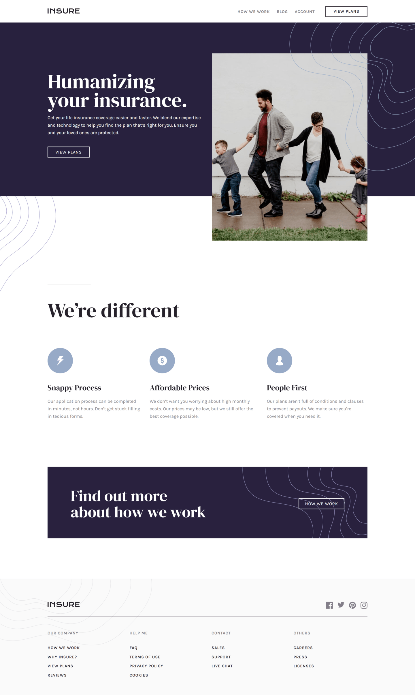

# Welcome! 👋

## Live

[Live](https://stupefied-perlman-a8c346.netlify.app/)

## The Challenge
Your challenge is to build out this landing page and get it looking as close to the design as possible.
- View the optimal layout for the site depending on their device's screen size
- See hover states for all interactive elements on the page

## Built With
- CSS custom propertys
- PostCss [
  - postcss-cli
  - postcss-import
  - postcss-preset-env
  - autoprefixer
  - cssnano
]
- Vanilla JS

## What I Practice
This is my first time using PostCss, was funny installed the plugins and use them.
btw the cssnano is for fun, beacuse is a little usefull in this case.

Also my naming of class is a little ok, made the html structure before try out the nesting and think that was equal than the scss and no xd

Any advice to improve is welcome :D

# Frontend Mentor 
